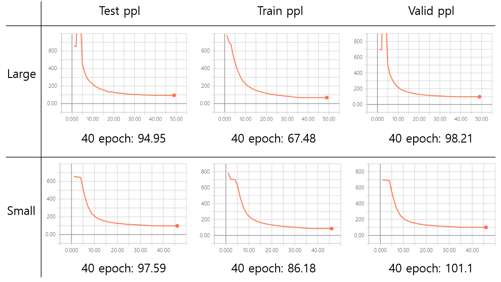
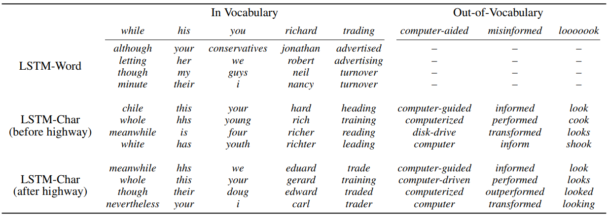
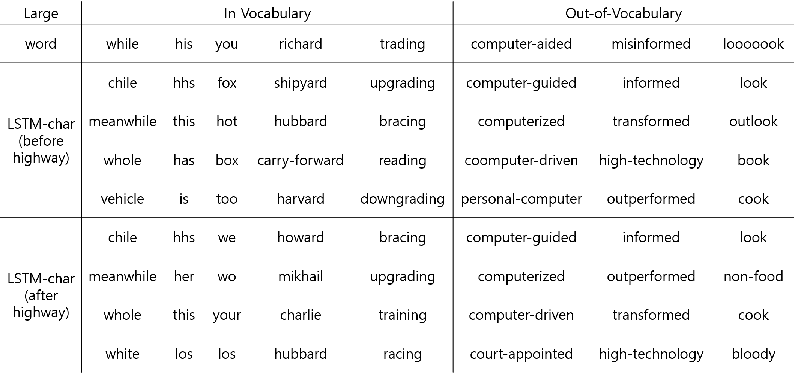
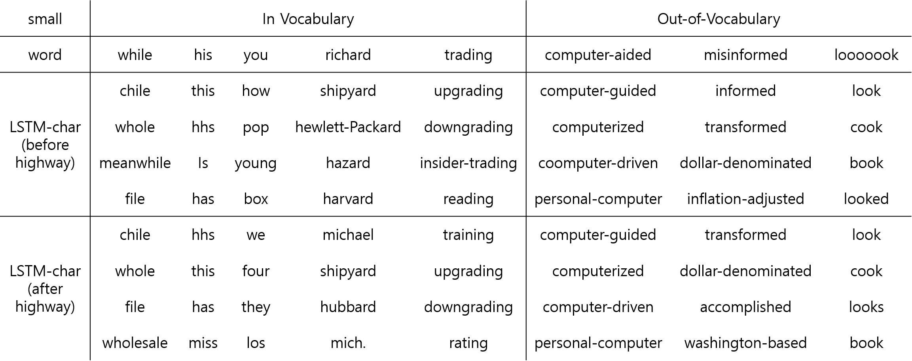

# TensorFlow-lstm-char-cnn
Character-Aware Neural Language Models (Yoon Kim), lstm-char-cnn

## Paper
   * Character-Aware Neural Language Model: https://arxiv.org/abs/1508.06615
     
   
## Dataset
   * PennTreebank(PTB)
     
   
## Perplexity 
   * Paper large_test_ppl: 78.9
   * Paper small_test_ppl: 92.3  
   * My result   
      * large_test_ppl: 94.95
      * small_test_ppl: 97.59    
   
     
   
## Nearest neighbor words (based on cosine similarity) 
   * paper   
     
   * large model   
     
   * small model   
     
